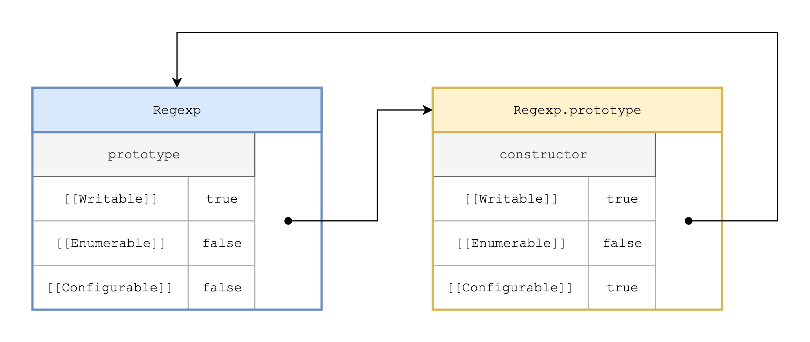

# Constructors

---

## Definition

A constructor is a function with an internal `[[Construct]]` property, that may be invoked with the `new` keyword.

* All **user defined ordinary synchronous functions** are constructors.
* **Some of the built-in functions** are constructors.
* None of the following are constructors:
  * arrow functions
  * asynchronous functions
  * generator functions
  * methods (defined through the concise method syntax)

Every constructor has an own `prototype` property that points to an object with an own `constructor` property, that in turn points back to the constructor.

* The `prototype` property is writable, non-enumerable and non-configurable.
* The `constructor` property is writable, non-enumerable and configurable.




### Caveats

Given that those properties are writable (and configurable for the `constructor` property) special care should be taken when manipulating them:

* The reference of the `prototype` property should not be replaced after instances were created.
* It should be ensured that the relationship `Constructor.prototype.constructor === Constructor` is maintained, where the `constructor` property should also be non-enumerable.

One of the cases where the `Constructor.prototype.constructor === Constructor` relationship can be broken, for instance, is when the reference of a constructor's `prototype` property is replaced:

```js
function Vertebrate() {}

// Bad:
Vertebrate.prototype = {
    method: () => {},
};

// Better:
Object.assign(Vertebrate.prototype, {
    method: () => {},
});
```

### Convention

Not all constructor functions are intended to be used as such. Constructor functions that are meant to be invoked with the `new` keyword are generally capitalized.

This is especially important in non-strict mode. Indeed constructor functions often make use of the `this` context, which will refer to the global object (instead of a newly created instance) in non-strict ordinary function invocations.

---

## Constructor Invocation

### Syntax

To invoke a function as a constructor, the function call needs to be preceded by the `new` keyword.​ Parentheses can be omitted When no parameters are passed to the function, . 

When a non-constructor function is invoked with the new keyword a `TypeError` is thrown.

```js
// Invoking a function as a constructor:
const Bird = function() {}

const dodo = new Bird()
const moa = new Bird            // Parentheses may be omitted

// Invoking a non-constructor function as a constructor:
const Reptile = () => {};
const a = new Reptile();        // TypeError: Reptile is not a constructor
```

### Description

Internally the following happens when a function is invoked as a constructor with the `new` keyword:

1. The [implicit parameter]() `new.target` is set to be the constructor itself (while in non constructor invocations it is set to **undefined**).
2. A new object is created.
3. The prototype of the newly created object is set to:
    * `new.target.prototype` (i.e the constructor’s `prototype` property) if it is an object.
    * `Object.prototype` if `new.target.prototype` property is a primitive value.
4. The constructor function is executed with the provided arguments and the `this` context bound to the newly created object.
5. If the function does not explicitly return an object, the newly created object is returned.

The `new` operator could thus be mimicked as follows:

```js
function invokeAsConstructor(Constructor, args) {
    const isObject = value => value && typeof value === "object";
    
    const prototype = isObject(Constructor.prototype) ? Constructor.prototype
                                                      : Object.prototype;
    const instance = Object.create(prototype);
    const returnValue = Constructor.apply(instance, args);

    return isObject(returnValue) ? returnValue : instance;
}
```

---

## Constructor Invocation (without `new`)

ES6 further provides ways to invoke functions as constructors without the use of the `new` keyword:

### `Reflect.construct()`

The `Reflect.construct(constructor, args[, newTarget])` method acts like the `new` operator, with the added possibility to specify a custom value for the implicit `new.target` parameter (and thus the prototype of the new instance). It takes three arguments:

1. `constructor`: the constructor to be called.
2. `args`: an [array like]() object specifying the arguments to be passed to the constructor.
3. `newTarget`: an optional constructor function that specifies the value of `new.target` in the constructor invocation (it defaults to `constructor`).

A `TypeError` is thrown if `constructor` or `newTarget` are not constructor functions or if `args` is not an array like object.

Invoking a constructor through `Reflect.construct()` has the exact same effect as calling it with the `new` keyword, except that `new.target` may be set to a different value than the original constructor in step 1 above. This makes it possible to use the initialisation logic of one constructor while using the `prototype` property of another one.

`super(...args)`

The `super()` invocation can be used inside the constructors of derived classes exclusively and is equivalent to:

1. Calling `Reflect.construct(SuperClass, args, Class)`.
2. Setting the `this` context to the resulting object.

(See also the notes on [classes]())

---

## Notes

### Instance / Constructor Relationship

There is no direct link between an instance and its constructor. They are merely related through the fact that the instance’s internal `[[Prototype]]` property and the constructor’s own `prototype` property both point to the same object. Special care should thus be taken with the following actions, which will disrupt the relationship between an instance and its constructor:

* Replacing the prototype of an instance with `Object.setPrototypeOf()`.
* Replacing the constructor’s `prototype` property after instances were created.

### Explicitly Returning Objects

Explicitly returning objects from constructor functions is discouraged. Indeed the benefit of constructor functions mainly lies in the fact that they automatically set up inheritance for newly created instances. This feature is lost by explicitly returning objects - in those case it may often be more appropriate and less confusing to use straight [factory functions]().

### Use Case for the `constructor` Property

Usually direct references to constructor functions are available and hence the `constructor` property pointing back to a constructor is rarely used.

The `constructor` property can still be handy when a reference to an instance’s immediate type is needed (and the instance is not known in advance).

Here is an example implementing an inherited `clone` method (see also [Pseudoclassical Inheritance]()):

```js
function Vertebrate(name) {
    this.name = name;
}
Vertebrate.prototype.clone = function() {
    return new this.constructor(this.name);
};

function Bird(name) {
    Vertebrate.call(this, name);
}
Bird.prototype = Object.create(Vertebrate.prototype, {
    constructor: {
        value: Bird,
        writable: true,
        configurable: true,
    },
});

const dodo = new Bird("Dodo");
const dodoClone = dodo.clone();

console.log(dodo);      //Bird { name: 'Dodo' }
console.log(dodoClone); //Bird { name: 'Dodo' }
```

**NB**: The above type of uses assumes that the relationship `Constructor.prototype.constructor === Constructor` is being enforced throughout.
