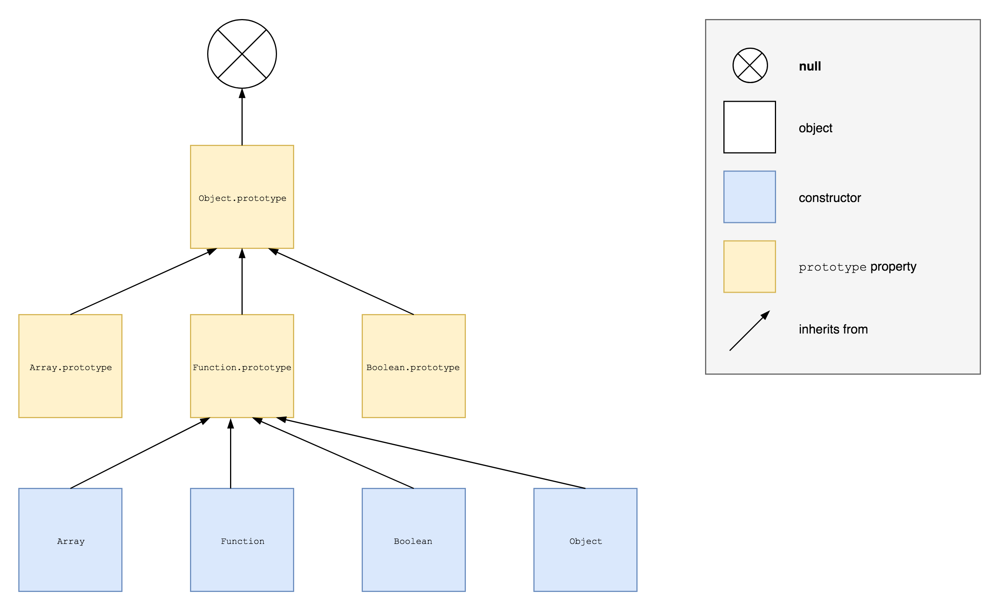

# `prototype` and `[[Prototype]]`

Much confusion about prototypes can be avoided by clearly distinguishing between the `prototype` property of ordinary synchronous functions and the internal `[[Prototype]]` property present on all JavaScript objects.

---

## `prototype`

Some built-in functions and all **user defined ordinary synchronous functions** get created with an own `prototype` property (along with the `name` and `length` properties) having the following attributes:

| **Attribute**     | **Value** |
| ----------------- |---------- |
| [[Writable]]      | `true`    |
| [[Enumerable]]    | `false`   |
| [[Configurable]]  | `false`   |

This allows those functions to operate as [constructors](/constructors) (shared methods and properties can be defined on the `prototype` object).

---

## `[[Prototype]]`

All JavaScript objects have an internal `[[Prototype]]` property that points to their prototype, which can either be another object or **null**.

### Legacy

Many browsers implemented an accessor property `__proto__` that exposed the internal `[[Prototype]]` property. This was included in ES6 as a legacy feature but is deprecated and should not be used. Instead `Object.getPrototypeOf()` and `Object.setPrototypeOf()` are now available (see [The Prototype Chain]().

---

## Example

As an illustration of the difference between the `prototype` and `[[Protoype]]` properties, consider part of the built-in prototype chain:

The diagram makes sense once one realises that all constructors are functions and thus inherit from `Function.prototype`, while the `prototype` properties refer to ordinary objects which thus inherit from `Object.prototype`. (Note the special case of `Function`, for which the `prototype` and `[[Prototype]]` properties point to the same object: `Function.prototype`.)

---

## Resources

* **Chapter 4 - Constructors and Prototypes**, _The Principles of Object-Oriented JavaScript_, Zakas (2014).
